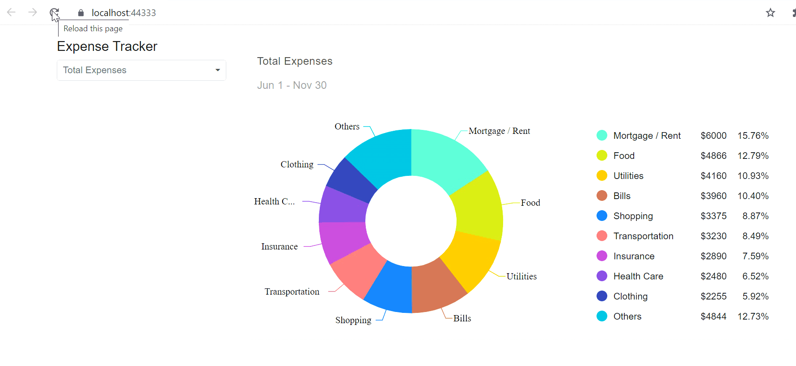

# Dynamically-Render-a-Component-in-Blazor-Application

This example demonstrates how to render the dynamic component in a Blazor server application.

## Prerequisites

- [.NET 6 Preview 1](https://dotnet.microsoft.com/download/dotnet/6.0)
- [Visual Studio tool](https://visualstudio.microsoft.com/vs/) with installed "ASP.NET and web development"

## To run the application

* Clone the repository using below command line from the command prompt.

```
git clone https://github.com/SyncfusionExamples/blazor-dynamic-component
```

* Navigate to the specified application folder.

```
cd blazor-dynamic-component
```

* Run the application using below command line.

```
dotnet run
```

* Copy/paste the localhost link in the browser to launch the application.

## Output Demo





## Blog reference

The detailed information about this is available in the blog,  

## See also

* [Online examples](https://blazor.syncfusion.com)
* [Documentation](https://blazor.syncfusion.com/documentation/introduction/)